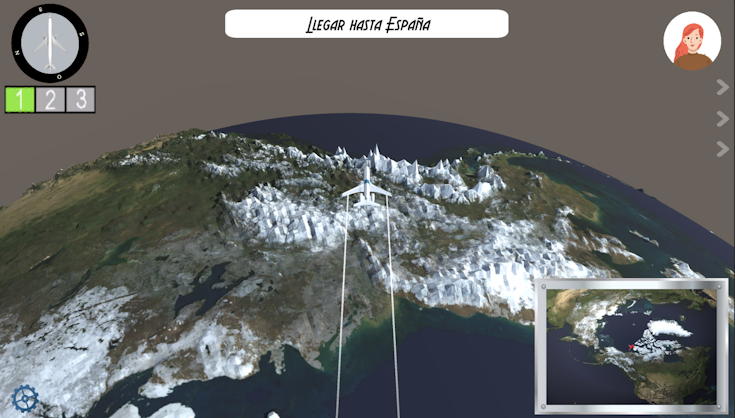

# **GeoGuide - Game Design Document**

- [**GeoGuide - Game Design Document**](#geoguide---game-design-document)
	- [**1 - Ficha técnica**](#1---ficha-técnica)
	- [**2 - Descripción**](#2---descripción)
	- [**3 - Propósito educativo y contexto de uso**](#3---propósito-educativo-y-contexto-de-uso)
	- [**4 - Jugabilidad**](#4---jugabilidad)
		- [**4.1 - Mecánicas del jugador**](#41---mecánicas-del-jugador)
		- [**4.2 - Cámara**](#42---cámara)
		- [**4.3 - Mecánicas de gameplay**](#43---mecánicas-de-gameplay)
	- [**5 - Diseño de nivel**](#5---diseño-de-nivel)
		- [**5.1 - Organización de niveles por continentes**](#51---organización-de-niveles-por-continentes)
		- [**5.2 - Descripción del nivel introductorio**](#52---descripción-del-nivel-introductorio)
		- [**5.3 - Descripción de niveles posteriores**](#53---descripción-de-niveles-posteriores)
			- [**5.3.1 - Pistas**](#531---pistas)
			- [**5.3.2 - Pistas**](#532---imprevistos)
	- [**6 - Interfaz**](#6---interfaz)
		- [**6.1 - Mockup del HUD in-game**](#61---mockup-del-hud-in-game)
			- [**6.1.1 - Explicación de los elementos del HUD in-game y su funcionamiento**](#611---explicación-de-los-elementos-del-hud-in-game-y-su-funcionamiento)
		- [**6.2 - Mockup de la interfaz del menú inicial**](#62---mockup-de-la-interfaz-del-menú-inicial)
			- [**6.2.1 - Explicación de los elementos de la interfaz del menú inicial y su funcionamiento**](#621---explicación-de-los-elementos-de-la-interfaz-del-menú-inicial-y-su-funcionamiento)
		- [**6.3 - Mockup de la interfaz del menú de niveles/menú principal**](#63---mockup-de-la-interfaz-del-menú-de-nivelesmenú-principal)
			- [**6.3.1 - Explicación de los elementos de la interfaz del menú de niveles y su funcionamiento**](#631---explicación-de-los-elementos-de-la-interfaz-del-menú-de-niveles-y-su-funcionamiento)
		- [**6.4 - Mockup de la interfaz del menú de información**](#64---mockup-de-la-interfaz-del-menú-de-información)
			- [**6.4.1 - Explicación de los elementos de la interfaz del menú de información y su funcionamiento**](#641---explicación-de-los-elementos-de-la-interfaz-del-menú-de-información-y-su-funcionamiento)
		- [**6.5 - Mockup de la interfaz del menú de pausa**](#65---mockup-de-la-interfaz-del-menú-de-pausa)
			- [**6.5.1 - Explicación de los elementos de la interfaz del menú de pausa y su funcionamiento**](#651---explicación-de-los-elementos-de-la-interfaz-del-menú-de-pausa-y-su-funcionamiento)
		- [**6.6 - Mockup de la interfaz del menú de ajustes**](#66---mockup-de-la-interfaz-del-menú-de-ajustes)
			- [**6.6.1 - Explicación de los elementos de la interfaz del menú de ajustes y su funcionamiento**](#661---explicación-de-los-elementos-de-la-interfaz-del-menú-de-ajustes-y-su-funcionamiento)
		- [**6.7 - Mockup de la interfaz del menú de controles**](#67---mockup-de-la-interfaz-del-menú-de-controles)
			- [**6.7.1 - Explicación de los elementos de la interfaz del menú de controles y su funcionamiento**](#671---explicación-de-los-elementos-de-la-interfaz-del-menú-de-controles-y-su-funcionamiento)
	- [**7 - Estética**](#7---estética)
	- [**8 - Menús y flujo de juego**](#8---menús-y-flujo-de-juego)
	- [**9 - Historia y personaje principal**](#9---historia-y-personaje-principal)
	- [**10 - Recursos**](#10---recursos)
	- [**11 - Referencias**](#11---referencias)

## **1 - Ficha técnica**
- **Título**: *GeoGuide*
- **Género**: Juego serio de simulación
- **Público objetivo**: Estudiantes de 8 a 15 años interesados en el aprendizaje de Geografía, sin necesidad de una base previa, de forma dinámica y entretenida.
- **Rating**: PEGI 7
- **Plataforma**: PC (Windows)
- **Modos de juego**:
	- Un jugador.

## **2 - Descripción**
Juego casual, de simulación, enfocado en el aprendizaje y descubrimiento geográfico, en el que el jugador pilotará un avión transportando clientes por el mundo al destino que le pidan y aprenderá todo tipo de datos interesantes sobre los países visitados.

## **3 - Propósito educativo y contexto de uso**
GeoGuide tiene como objetivo enseñar geografía mundial desde cero a estudiantes jóvenes, sin necesidad de base previa. Esto se realiza mediante técnicas de enseñanza como el refuerzo positivo y la asociación de conceptos en lugar de las técnicas habituales de memorización y prueba y error.

Gracias a una breve introducción guiada de algunos países y a las cartas de información, llenas de datos interesantes sobre los lugares visitados, el usuario podrá llevar a sus clientes a cualquier parte del mundo, relacionando la información dada previamente, ampliando su conocimiento. Toda la información dada se guarda en las tarjetas informativas no sólo para ayudar al jugador a situarse, sino también para crear recuerdos y asociarlos a lugares.

En cuanto al contexto de uso, GeoGuide puede ser usado en clase como ejercicio dinámico y divertido para que los alumnos aprendan. El profesor podría pedirle a sus alumnos que intenten resolver los niveles del continente que estén estudiando. Pero también puede ser un apoyo extra para que los alumnos practiquen en su casa.

## **4 - Jugabilidad**
### **4.1 - Mecánicas del jugador**
<table>
	<tr>
		<th>Acciones</th>
		<th>Descripción</th>
		<th>Input</th>
	</tr>
	<tr>
		<td><b>Pilotar el avión</b></td>
		<td>En cada nivel el avión se moverá constantemente hacia delante con una velocidad constante inicial. El usuario podrá girarlo hacia la derecha e izquierda con A y D respectivamente y podrá cambiar su velocidad con la W(aumentar) y S(reducir).</td>
		<td>W A S D</td>
	</tr>
	<tr>
		<td><b>Aterrizar avión</b></td>
		<td>Cada país del mundo tendrá un <u><a href="#43---mecánicas-de-gameplay">aeropuerto</a></u>. Una vez se ha llegado al aeropuerto del país destino, el jugador podrá aterrizar pulsando el espacio. Una vez aterrizado se decidirá las <u><a href="#53---descripción-de-niveles-posteriores-o-imprevistos">estrellas</a></u> conseguidas.</td>
		<td>Barra espaceadora</td>
	</tr>
	<tr>
		<td><b>Cambio de velocidad</b></td>
		<td>El avión tendrá únicamente tres tipos de velocidades constantes que se podrán modificar con las teclas 1(lento), 2(normal) y 3(rápido).</td>
		<td>1 2 3</td>
	</tr> 
</table>

### **4.2 - Cámara**
La vista del juego será en tercera persona con respecto al avión, girando y moviéndose para mantener al jugador en el centro de la pantalla y mirando hacia delante en todo momento. 

<figure>

<figcaption>
<i><b>Imagen 1</b> - Ejemplo de vista en tercera persona de nuestro juego</i>
</figcaption>
</figure>

### **4.3 - Mecánicas de gameplay**
<table>
	<tr>
		<th>Mecánica</th>
		<th>Imagen</th>
		<th>Funcionamiento</th>
	</tr>
	<tr>
		<td>Brújula</td>
		<td></td>
		<td>Elemento que será útil para misiones que describan la ubicación del país destino como “al norte/sur/este/oeste de …”.</td>
	</tr>
	<tr>
		<td>Minimapa</td>
		<td></td>
		<td>Pequeña pantalla que muestra una versión más ampliada del mundo para ayudar al jugador a ubicarse por el mapa.</td>
	</tr>
	<tr>
		<td>Cliente</td>
		<td></td>
		<td>Durante la partida, el cliente mencionará curiosidades geográficas sobre el país destino. Además, transcurrido un tiempo específico, para ayudar al jugador y así evitar frustrar, el cliente le proporcionará una pista.El número total de pistas será 3, en caso de necesitarlas.</td>
	</tr>
	<tr>
		<td>Aeropuerto</td>
		<td></td>
		<td>Área donde podrás depositar a los clientes una vez hayas localizado el país correcto. Sólo podrás hacer ésto si pones el avión a velocidad lenta o “de aterrizaje”.</td>
	</tr>
	<tr>
		<td>Jefe</td>
		<td></td>
		<td>Personaje que te guiará en los niveles de aprendizaje y, pasado un tiempo suficientemente largo a determinar, te ofrecerá ayuda en los niveles normales / te avisará de imprevistos meteorológicos.</td>
	</tr>
</table>

## **5 - Diseño de nivel**
### **5.1 - Organización de niveles por continentes**
Los niveles del juego estarán organizados por continentes (Europa, Asia, África, América, Oceanía), y cada continente tendrá un número de niveles (por ejemplo, 3). Antes de empezar las misiones de un nuevo continente, el jugador tendrá que jugar un nivel introductorio. Para desbloquear los distintos niveles, tanto dentro de un mismo continente, como entre continentes, será necesario tener un mínimo de estrellas, que se conseguirán en los niveles previamente desbloqueados.
### **5.2 - Descripción del nivel introductorio**
En los niveles introductorios, el jefe te irá guiando por los “principales” países de ese continente, de los cuales ganarás tarjetas de información para consultar posteriormente. Estas tarjetas incluirán recuerdos, pero la foto mostrará a tu jefe en lugar de un cliente.

Las tarjetas* que ganes en los niveles introductorios incluirán recuerdo, pero la foto mostrará a tu jefe en lugar de un cliente.
### **5.3 - Descripción de niveles posteriores**
En los niveles normales, el jugador recibirá una misión de su cliente, pidiéndole que le lleve a algún país específico. El cliente puede pedirle directamente al jugador su destino indicando el nombre del país al que quiere viajar, o bien con una “prompt” sobre algún dato concreto del país. Estos datos **siempre** provendrán de información que el propio juego le proporciona al usuario con las tarjetas de información. Dependiendo de la complejidad, a lo largo del nivel habrá varios clientes a los que deberemos llevar al país pedido.
#### **5.3.1 - Pistas**
Si el jugador tarda mucho, o falla en encontrar el país, el cliente le irá dando pistas para facilitar encontrarlo. Estas pistas estarán repartidas durante el juego usando un cronómetro interno o por intentos fallidos. Por ejemplo: pasados 2 minutos, si el jugador aún no sabe dónde ir, se dará la primera para evitar que se frustre e intentar guiarlo. Pasado 1 minuto desde la primera pista se proporcionará la siguiente y, tras otro minuto, la última.

Ya que nuestro juego se basa en el aprendizaje desde cero, no queremos frustrar ni castigar al usuario por fallar. Nuestra intención es que el usuario identifique y relacione los países a los datos proporcionados por el jefe, los clientes y las tarjetas. Queremos evitar la filosofía de “prueba y error” y que estos lugares sean más que un punto en el mapa. Por eso mismo, se le proporcionarán 3 pistas y, tras ellas, si el jugador aún está perdido, se le guiará hacia el destino. 
##### **5.3.2 - Imprevistos**
Además, en niveles algo más avanzados, podrán aparecer tormentas o imprevistos meteorológicos por el mapa que el jugador tendrá que esquivar.

En cada nivel el jugador podrá ganar hasta tres estrellas, aunque solo necesitará una para desbloquear el siguiente nivel y ganar una(s) tarjeta(s). En caso de ganar las 3, conseguirá un recuerdo del cliente para adornar su tarjeta de información.

## **6 - Interfaz**
### **6.1 - Mockup del HUD in-game**
#### **6.1.1 - Explicación de los elementos del HUD in-game y su funcionamiento**
<table>
	<tr>
		<th><b>Elemento</b></th>
		<th><b>Imagen</b></th>
		<th><b>Explicación</b></th>
	</tr>
	<tr>
		<td>Recuadro de misión</td>
		<td>-Aquí va una imagen del recuadro de misiones una vez acabado el juego-</td>
		<td>En la parte superior de la pantalla aparecerá un recuadro rectangular que contiene el objetivo de nuestra misión actual. Por ejemplo, si nuestro cliente quiere visitar un país al sur de Dinamarca, en la parte superior de la pantalla nos aparecerá un texto del estilo <i>Lleva al cliente a un país al sur de Dinamarca</i>.</td>
	</tr>
	<tr>
		<td>Pistas</td>
		<td>-Aquí va una imagen de las pistas una vez acabado el juego-</td>
		<td>Justo debajo de la imagen de nuestro cliente, aparecerán las sucesivas pistas que este te va dando si no consigues encontrar el país que este te pide. Las pistas son una lista vertical de tres bocadillos con un pequeño texto a modo de pista. Por ejemplo, siguiendo con el ejemplo anterior, podemos tener de pistas <i>Un monumento importante es la Puerta de Brandemburgo</i>, <i>Es la cuna de la industria automotriz europea</i> y <i>Su capital es Berlín</i>.</td>
	</tr>
	<tr>
		<td>Botón de menú de pausa</td>
		<td>-Aquí va una imagen del botón de menú de pausa una vez acabado el juego</td>
		<td>En la esquina inferior izquierda encontramos el botón que nos lleva al menú de pausa.</td>
	</tr>
</table>

### **6.2 - Mockup de la interfaz del menú inicial**
#### **6.2.1 - Explicación de los elementos de la interfaz del menú inicial y su funcionamiento**
<table>
	<tr>
		<th><b>Elemento</b></th>
		<th><b>Imagen</b></th>
		<th><b>Explicación</b></th>
	</tr>
	<tr>
		<td>Botón de "Jugar"</td>
		<td>-Aquí va una imagen del botón de jugar-</td>
		<td>Al pulsar este botón vamos al menú de los niveles, que va actuar como nuestro menú principal.</td>
	</tr>
	<tr>
		<td>Botón de "Salir"</td>
		<td>-Aquí va una imagen del botón de salir-</td>
		<td>Al pulsar este botón salimos del juego.</td>
	</tr>
</table>

### **6.3 - Mockup de la interfaz del menú de niveles/menú principal**
#### **6.3.1 - Explicación de los elementos de la interfaz del menú de niveles y su funcionamiento**
<table>
	<tr>
		<th><b>Elemento</b></th>
		<th><b>Imagen</b></th>
		<th><b>Explicación</b></th>
	</tr>
	<tr>
		<td>Lista de niveles</td>
		<td>-Aquí va una imagen con la lista de niveles-</td>
		<td>En la parte izquierda del menú encontramos una lista con todos los niveles jugables en nuestro juego. Los niveles están separados por continentes, y cada uno de los botones del nivel tiene el número de nivel y el número de estrellas conseguidas, inicialmente, 3 estrellas en color gris para luego rellenarse con estrellas doradas.</td>
	</tr>
	<tr>
		<td>Botón de ajustes</td>
		<td>-Aquí va una imagen del botón de jugar-</td>
		<td>En la esquina inferior derecha tenemos el botón con la rueda de ajustes, que al pulsar, nos lleva al menú de ajustes.</td>
	</tr>
	<tr>
		<td>Botón de tarjetas obtenidas</td>
		<td>-Aquí va una imagen del botón de jugar-</td>
		<td>En la esquina superior derecha nos encontramos con un botón, en forma de globo terráqueo, que contiene el submenú de las tarjetas obtenidas. En este menú tendremos una lista con todas las tarjetas de todos los países que hemos visitado a lo largo de los niveles que hemos jugado. Las tarjetas se explicarán mejor en el apartado <i><a href="#641---explicación-de-los-elementos-de-la-interfaz-del-menú-de-información-y-su-funcionamiento">5.4.1 - Explicación de los elementos de la interfaz del menú de información y su funcionamiento.</a></i></td>
	</tr>
	<tr>
		<td>Botón de volver atrás</td>
		<td>-Aquí va una imagen del botón de jugar-</td>
		<td>En la esquina inferior izquierda tenemos el botón que nos permite volver atrás al menú inicial, donde podremos salir del juego.</td>
	</tr>
</table>

### **6.4 - Mockup de la interfaz del menú de información**
#### **6.4.1 - Explicación de los elementos de la interfaz del menú de información y su funcionamiento**
<table>
	<tr>
		<th><b>Elemento</b></th>
		<th><b>Imagen</b></th>
		<th><b>Explicación</b></th>
	</tr>
	<tr>
		<td>Tarjetas de información</td>
		<td></td>
		<td>El menú entero está ocupado por una lista de tarjetas en las que encontraremos el nombre del país, su bandera, una foto de un lugar de interés del país e información referente a este, como por ejemplo capital, habitantes, comida típica, dato histórico curioso, etc... Las tarjetas se van desbloqueando conforme vayamos visitando países distintos durante el juego.</td>
	</tr>
</table>

### **6.5 - Mockup de la interfaz del menú de pausa**
#### **6.5.1 - Explicación de los elementos de la interfaz del menú de pausa y su funcionamiento**
<table>
	<tr>
		<th><b>Elemento</b></th>
		<th><b>Imagen</b></th>
		<th><b>Explicación</b></th>
	</tr>
	<tr>
		<td>Botón de volver al juego</td>
		<td></td>
		<td>Este botón nos permite volver al juego tal y donde lo dejamos.</td>
	</tr>
	<tr>
		<td>Botón de ajustes</td>
		<td></td>
		<td>Este botón nos permite ir al menú de ajustes.</td>
	</tr>
	<tr>
		<td>Botón de información</td>
		<td></td>
		<td>Este botón nos permite ir al menú de información para poder consultar los países ya visitados en caso de que se nos olviden en mitad de la partida.</td>
	</tr>
	<tr>
		<td>Botón de salir de la partida</td>
		<td></td>
		<td>Este botón nos permite volver al menú principal y abandonar el nivel en el que estamos actualmente.</td>
	</tr>
</table>

### **6.6 - Mockup de la interfaz del menú de ajustes**
#### **6.6.1 - Explicación de los elementos de la interfaz del menú de ajustes y su funcionamiento**
<table>
	<tr>
		<th><b>Elemento</b></th>
		<th><b>Imagen</b></th>
		<th><b>Explicación</b></th>
	</tr>
	<tr>
		<td>Botón de ajustes gráficos</td>
		<td></td>
		<td>Este botón nos llevará al menú de ajustes gráficos, en el que encontraremos ajustes para el brillo de la pantalla, resolución, pantalla completa, etc... -aún por ver lo que se va a meter-</td>
	</tr>
	<tr>
		<td>Botón de ajustes de sonido</td>
		<td></td>
		<td>Este botón nos llevará al menú de ajustes de sonido, en el que encontraremos ajustes para el volumen general, volumen de elementos de la interfaz, etc...</td>
	</tr>
	<tr>
		<td>Botón de controles</td>
		<td></td>
		<td>Este botón nos llevará al menú de controles, en el que podremos consultar los controles a usar con los diferentes elementos del juego.</td>
	</tr>
	<tr>
		<td>Botón de volver atrás</td>
		<td></td>
		<td>Este botón nos llevará al menú inmediatamente anterior, desde el cual hayamos accedido al menú de ajustes.</td>
	</tr>
</table>

### **6.7 - Mockup de la interfaz del menú de controles**
#### **6.7.1 - Explicación de los elementos de la interfaz del menú de controles y su funcionamiento**
<table>
	<tr>
		<th><b>Elemento</b></th>
		<th><b>Imagen</b></th>
		<th><b>Explicación</b></th>
	</tr>
	<tr>
		<td>Lista de controles</td>
		<td></td>
		<td>En pleno centro del menú encontraremos una lista con los controles que hemos definido para los diversos elementos del juego, por ejemplo, manejo del avión, interactuar con los clientes, aterrizar, cambiar velocidad del avión, etc...</td>
	</tr>
</table>

## **7 - Estética**
La estética del juego se basa en un estilo _cartoon_, suave, sencillo y colorido, pero sobre todo atractivo para nuestro público objetivo ideal. Una estética más realista y decorada puede llevar a los jugadores a la distracción, algo poco conveniente cuando se trata de un juego principalmente educativo; por ello, hemos decidido una estética más sobria y sencilla, la cual evite cualquier tipo de distracción y permita al jugador centrarse en el aprendizaje.

Este estilo se podrá ver en el diseño de las interfaces, las cuales están pensadas para ser sencillas y fáciles de usar; el diseño de los clientes, los cuales tendrán pocos detalles y serán muy sencillos; y, principalmente, el mapa terrestre, en el cual los países no tendrán ningún tipo de información acerca de los accidentes geográficos (es decir, montañas, ríos, valles, zonas nevadas, etc... no serán visibles en el mapa), ya que será un mapa plano en el que ¿¿(cada país tiene un color distinto a los países que lo rodean)??

## **8- Menús y flujo de juego**

## **9 - Historia y personaje principal**
<table>
	<tr>
		<td>Jugador</td>
		<td>El jugador encarnará a un nuevo piloto de una aerolínea encargada de llevar a clientes por el mundo, durante el juego irá ganando conocimiento sobre los distintos países gracias a sus clientes y a la experiencia de sus viajes hasta que es ascendido a piloto senior(?)</td>
	</tr>
</table>

## **10 - Recursos**

## **11 - Referencias**
### **11.1 - Videojuegos**
- [*GeoGuessr* (2013)](https://www.geoguessr.com/es), videojuego en web diseñado por [**Anton Wallén**](https://twitter.com/antonwallen).
- [*Geotastic* (2021)](https://geotastic.net/home), videojuego similar a *GeoGuessr* creado por [*Edutastic Games*](https://www.edutastic.de).
- [*Geographical Adventures* (2022)](https://sebastian.itch.io/geographical-adventures), videojuego creado por [**Sebastian Lague**](https://www.youtube.com/@SebastianLague) en su serie de YouTube homónima.
- [*Microsoft Flight Simulator*](https://www.flightsimulator.com), serie de videojuegos de simulación aérea creada por Microsoft.
