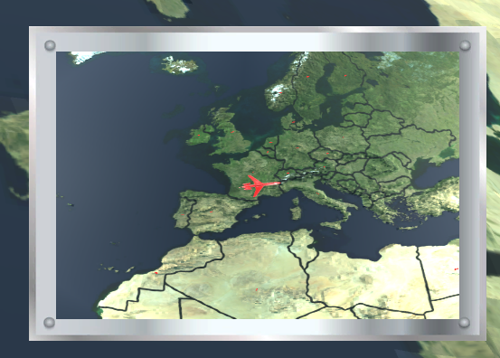
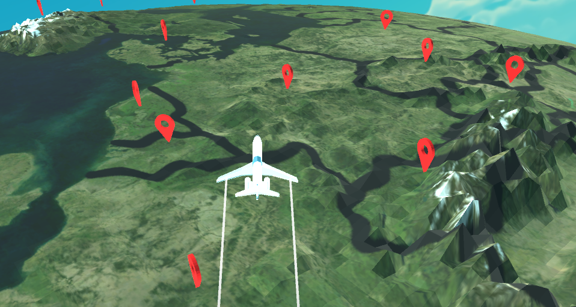
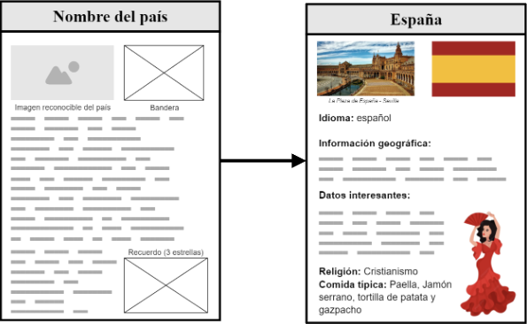
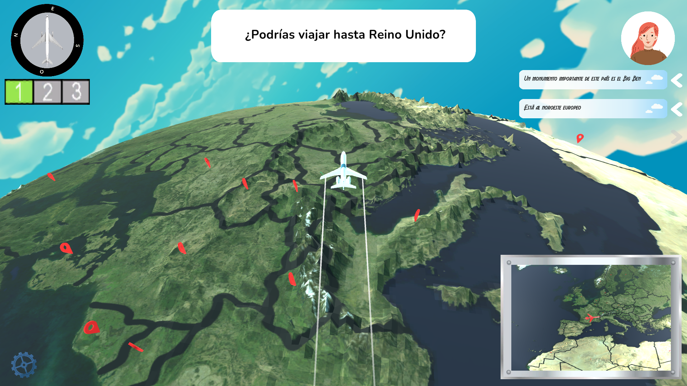
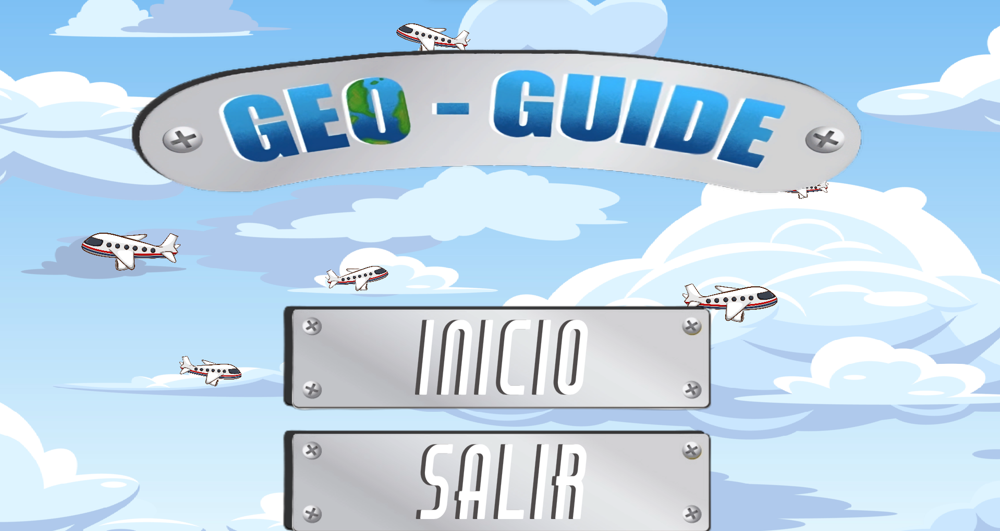
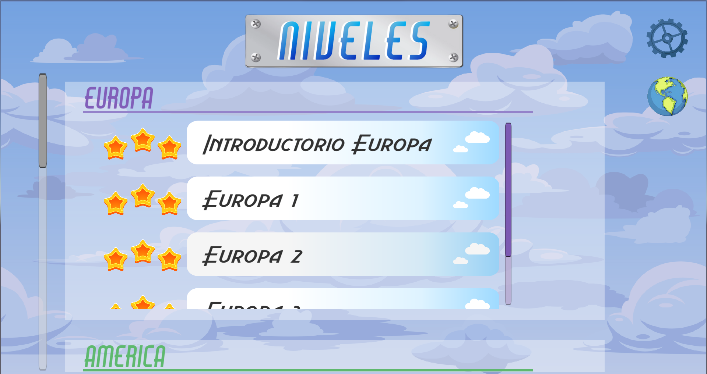
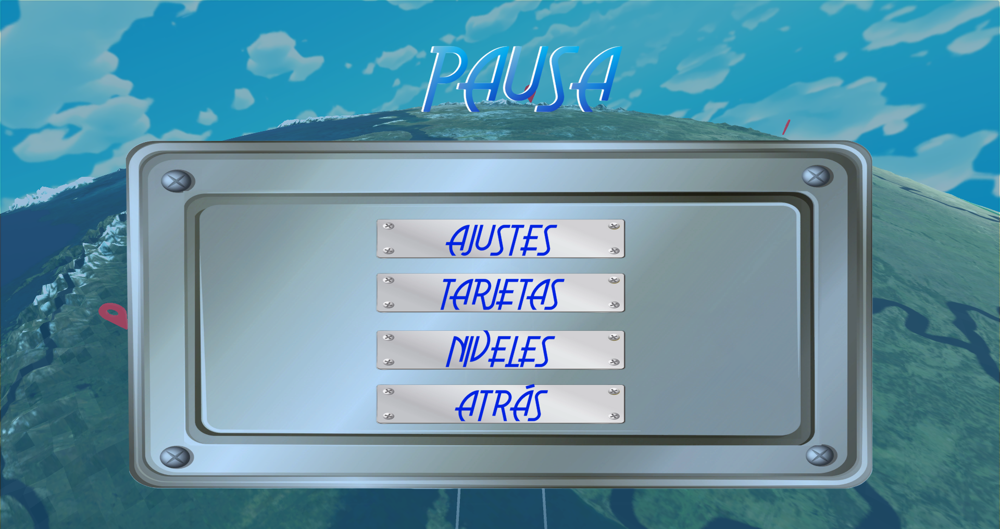
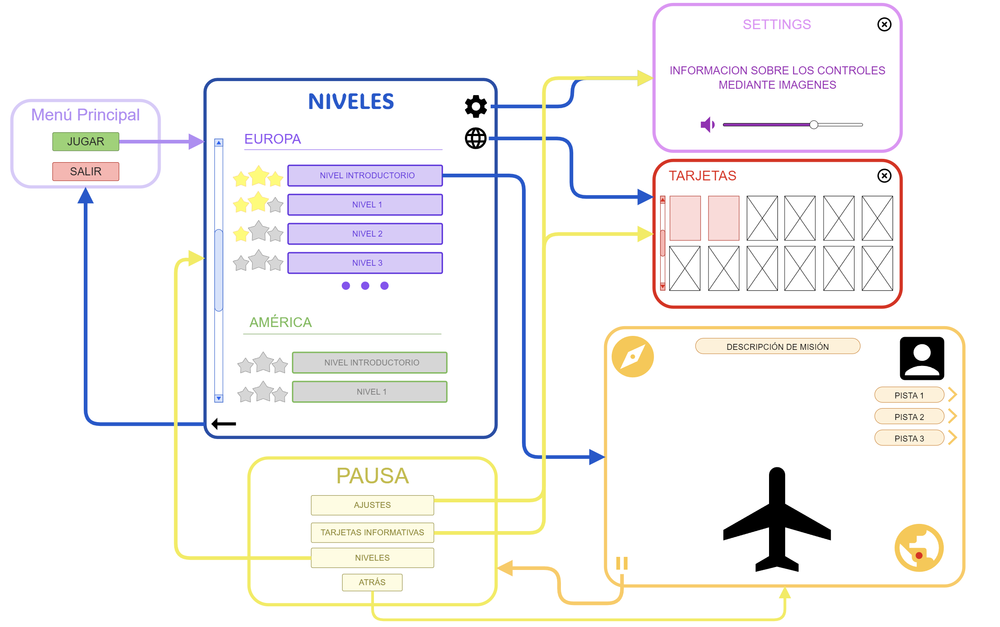

# **GeoGuide - Game Design Document**

- [**Índice**](#geoguide---game-design-document)
	- [**1 - Ficha técnica**](#1---ficha-técnica)
	- [**2 - Descripción**](#2---descripción)
	- [**3 - Propósito educativo y contexto de uso**](#3---propósito-educativo-y-contexto-de-uso)
	- [**4 - Interés y aprendizaje del jugador**](#4---interés-y-aprendizaje-del-jugador)
	- [**5 - Jugabilidad**](#5---jugabilidad)
		- [**5.1 - Mecánicas del jugador**](#51---mecánicas-del-jugador)
		- [**5.2 - Cámara**](#52---cámara)
		- [**5.3 - Mecánicas de gameplay**](#53---mecánicas-de-gameplay)
	- [**6 - Historia y personaje principal**](#6---historia-y-personaje-principal)
	- [**7 - Diseño de nivel**](#7---diseño-de-nivel)
		- [**7.1 - Organización de niveles por continentes**](#71---organización-de-niveles-por-continentes)
		- [**7.2 - Descripción del nivel introductorio**](#72---descripción-del-nivel-introductorio)
		- [**7.3 - Descripción de niveles posteriores**](#73---descripción-de-niveles-posteriores)
			- [**7.3.1 - Objetivo**](#731---objetivo)
			- [**7.3.2 - Reparto de estrellas**](#732---reparto-de-estrellas)
			- [**7.3.3 - Pistas**](#733---pistas)
			- [**7.3.4 - Imprevistos**](#734---imprevistos)
		- [**7.4 - Tarjetas**](#74---tarjetas)
	- [**8 - Interfaz**](#8---interfaz)
		- [**8.1 - Mockup del HUD in-game**](#81---mockup-del-hud-in-game)
			- [**8.1.1 - Explicación de los elementos del HUD in-game y su funcionamiento**](#811---explicación-de-los-elementos-del-hud-in-game-y-su-funcionamiento)
		- [**8.2 - Mockup de la interfaz del menú inicial**](#82---mockup-de-la-interfaz-del-menú-inicial)
			- [**8.2.1 - Explicación de los elementos de la interfaz del menú inicial y su funcionamiento**](#821---explicación-de-los-elementos-de-la-interfaz-del-menú-inicial-y-su-funcionamiento)
		- [**8.3 - Mockup de la interfaz del menú de niveles/menú principal**](#83---mockup-de-la-interfaz-del-menú-de-nivelesmenú-principal)
			- [**8.3.1 - Explicación de los elementos de la interfaz del menú de niveles y su funcionamiento**](#831---explicación-de-los-elementos-de-la-interfaz-del-menú-de-niveles-y-su-funcionamiento)
		- [**8.4 - Mockup de la interfaz del menú de información**](#84---mockup-de-la-interfaz-del-menú-de-información)
			- [**8.4.1 - Explicación de los elementos de la interfaz del menú de información y su funcionamiento**](#841---explicación-de-los-elementos-de-la-interfaz-del-menú-de-información-y-su-funcionamiento)
		- [**8.5 - Mockup de la interfaz del menú de pausa**](#85---mockup-de-la-interfaz-del-menú-de-pausa)
			- [**8.5.1 - Explicación de los elementos de la interfaz del menú de pausa y su funcionamiento**](#851---explicación-de-los-elementos-de-la-interfaz-del-menú-de-pausa-y-su-funcionamiento)
		- [**8.6 - Mockup de la interfaz del menú de controles**](#86---mockup-de-la-interfaz-del-menú-de-controles)
			- [**8.6.1 - Explicación de los elementos de la interfaz del menú de controles y su funcionamiento**](#861---explicación-de-los-elementos-de-la-interfaz-del-menú-de-controles-y-su-funcionamiento)
	- [**9 - Estética**](#9---estética)
	- [**10 - Menús y flujo de juego**](#10---menús-y-flujo-de-juego)
	- [**11 - Recursos**](#11---recursos)
	- [**12 - Referencias**](#12---referencias)

## **1 - Ficha técnica**
- **Título**: *GeoGuide*
- **Género**: Juego serio de simulación
- **Público objetivo**: Estudiantes de 8 a 15 años interesados en el aprendizaje de Geografía, sin necesidad de una base previa, de forma dinámica y entretenida.
- **Rating**: PEGI 7
- **Plataforma**: PC (Windows)
- **Modos de juego**:
	- Un jugador.

## **2 - Descripción**
Juego casual, de simulación, enfocado en el aprendizaje y descubrimiento geográfico, en el que el jugador pilotará un avión transportando clientes por el mundo al destino que le pidan y aprenderá todo tipo de datos interesantes sobre los países visitados.

## **3 - Propósito educativo y contexto de uso**
GeoGuide tiene como objetivo enseñar geografía mundial desde cero a estudiantes jóvenes, sin necesidad de base previa. Esto se realiza mediante técnicas de enseñanza como el refuerzo positivo y la asociación de conceptos en lugar de las técnicas habituales de memorización y prueba y error.

Gracias a una breve introducción guiada de algunos países y a las cartas de información, llenas de datos interesantes sobre los lugares visitados, el usuario podrá llevar a sus clientes a cualquier parte del mundo, relacionando la información dada previamente, ampliando su conocimiento. Toda la información dada se guarda en las tarjetas informativas no sólo para ayudar al jugador a situarse, sino también para crear recuerdos y asociarlos a lugares.

En cuanto al contexto de uso, hemos tenido en cuenta los contenidos de las asignaturas de Geografía (y similares) que se imparten en los colegios e institutos (establecida por la actual ley LOMLOE) a alumnos dentro de nuestro rango de edad objetivo: en el colegio, principalmente se suele profundizar en la geografía física y política del territorio nacional (entre 1º de Primaria y 4º de Primaria), empezándose a ver las geografías política y física del territorio europeo a partir de 5º de Primaria; mientras que en el Instituto, entre los cursos de 1º de la ESO hasta 3º de la ESO se suelen ver, de manera sucesiva, tanto los mapas políticos de Europa, como los de África, América y Asia (no se suele hacer mucho hincapié en la geografía de Oceanía). 

Es por eso que GeoGuide puede ser usado en clase como ejercicio dinámico y divertido para que los alumnos aprendan (por ejemplo, el profesor podría pedirle a sus alumnos que intenten resolver los niveles del continente que estén estudiando); pero también puede ser un apoyo extra para que los alumnos practiquen de manera autónoma en casa, a modo de refuerzo de la lección estudiada anteriormente o a modo de repaso para un examen.

## **4 - Interés y aprendizaje del jugador**
En el diseño del juego, hemos tenido en cuenta elementos que nos ayudan a mantener el interés de nuestros jugadores y a asegurarnos de que están aprendiendo, por ejemplo:
la narrativa, que presenta una historia de progreso, con una meta final definida, apoyada por un sistema de niveles por estrellas, que les presentan a los jugadores el reto de conseguirlos todos con la mejor puntuación posible, reforzados por recompensas extra si consiguen las 3 (puntuación máxima). 
Además, dentro de los propios niveles, nos aseguramos de que el jugador no se frustre en exceso y mantenga la atención mediante un reloj interno que comprueba si el jugador lleva demasiado tiempo sin acertar desde que comenzó el nivel y le aporta pistas correspondientemente. Pasados los tres intentos fallidos o demasiado tiempo, se le preguntará al jugador si quiere que se le “chive” donde estaba el país destino. El nivel no contará como completado pero evitará que el jugador se frustre en caso de atascarse.

## **5 - Jugabilidad**
### **5.1 - Mecánicas del jugador**
<table>
	<tr>
		<th>Acciones</th>
		<th>Descripción</th>
		<th>Input</th>
	</tr>
	<tr>
		<td><b>Pilotar el avión</b></td>
		<td>En cada nivel el avión se moverá constantemente hacia delante con una velocidad constante inicial. El usuario podrá girarlo hacia la derecha e izquierda con A y D respectivamente y podrá cambiar su velocidad con la W(aumentar) y S(reducir).</td>
		<td>W A S D</td>
	</tr>
	<tr>
		<td><b>Aterrizar avión</b></td>
		<td>Cada país del mundo tendrá un <u><a href="#53---mecánicas-de-gameplay">aeropuerto</a></u>. Una vez se ha llegado al aeropuerto del país destino, el jugador podrá aterrizar pulsando el espacio. Una vez aterrizado se decidirá las <u><a href="#73---descripción-de-niveles-posteriores">estrellas</a></u> conseguidas.</td>
		<td>Barra espaceadora</td>
	</tr>
	<tr>
		<td><b>Cambio de velocidad</b></td>
		<td>El avión tendrá únicamente tres tipos de velocidades constantes que se podrán modificar con las teclas 1(lento), 2(normal) y 3(rápido).</td>
		<td>1 2 3</td>
	</tr> 
</table>

### **5.2 - Cámara**
La vista del juego será en tercera persona con respecto al avión, girando y moviéndose para mantener al jugador en el centro de la pantalla y mirando hacia delante en todo momento. 

<figure>

<figcaption>
<i><b>Imagen 1</b> - Ejemplo de vista en tercera persona de nuestro juego</i>
</figcaption>
</figure>

### **5.3 - Mecánicas de gameplay**
<table>
	<tr>
		<th>Mecánica</th>
		<th>Imagen</th>
		<th>Funcionamiento</th>
	</tr>
	<tr>
		<td>Brújula</td>
		<td></td>
		<td>Elemento que será útil para misiones que describan la ubicación del país destino como “al norte/sur/este/oeste de …”.</td>
	</tr>
	<tr>
		<td>Velocímetro</td>
		<td></td>
		<td>Debajo de la brújula aparecerá un pequeño indicador que muestra la velocidad a la que el jugador va: 1 (lento, aterrizar); 2 (medio); 3 (rápido). En color verde se mostrará la velocidad actual.</td>
	</tr>
	<tr>
		<td>Minimapa</td>
		<td></td>
		<td>Pequeño globo que muestra la posición del jugador más alejada del suelo para ayudar al jugador a ubicarse por el mundo</td>
	</tr>
	<tr>
		<td>Cliente</td>
		<td>
			<figure>
				

				<figcaption>
<i>Depende del cliente</i>

			</figure>
		</td>
		<td>Durante la partida, el cliente mencionará curiosidades geográficas sobre el país destino. Además, transcurrido un tiempo específico, para ayudar al jugador y así evitar frustrar, el cliente le proporcionará una pista. El número total de pistas será 3, en caso de necesitarlas. </td>
	</tr>
	<tr>
		<td>Aeropuerto</td>
		<td></td>
		<td>Zona circular roja donde podrás dejar a los clientes. Sólo podrás hacer ésto si pones el avión a velocidad lenta o “de aterrizaje”. Una vez hayas aterrizado, si el país fue el correcto se pasará al siguiente cliente en caso de haberlo, o terminará el nivel. Si se ha fallado, se notificará, se restará un intento y el jugador podrá continuar.</td>
	</tr>
	<tr>
		<td>Jefe</td>
		<td></td>
		<td>Personaje que te guiará en los niveles de aprendizaje. Te avisará de imprevistos meteorológicos y, pasado un tiempo suficientemente largo, te preguntará si quieres que te guíe al país destino para que el jugador no se sienta bloqueado, ni se atasque en algún nivel.</td>
	</tr>
</table>

**Todo el arte se hará a mano o se usarán assets previamente creados *free to use* o a los que tengamos permisos.**

## **6 - Historia y personaje principal**
Como jugador encarnarás al hijo de un director (en otros apartados aparecerá como “Jefe”) de una agencia de viajes aérea, que ha decidido jubilarse y dejar el negocio familiar en tus manos. Has estudiado muy duro, pero apenas tienes práctica, por lo que entrarás a la flota como piloto júnior. Es por eso que tu padre ha diseñado un plan para que llegues a ser un piloto sénior en el menor tiempo posible antes de delegar la empresa en ti. Este plan tiene como objetivo dominar los mandos del avión y aprender qué rutas ofrece la empresa a los distintos países.

Este plan en la historia se relaciona de manera directa con el gameplay del juego: que el protagonista aprenda a dominar los mandos del avión se relaciona con que el jugador humano aprenda los controles físicos (teclado) del avión; mientras que las rutas que se ofrecen son el contenido educativo geográfico que se plantea enseñar en nuestro juego.

A lo largo del juego, el jugador irá aprendiendo y superando los diferentes niveles hasta que, finalmente, tras superarlos todos es nombrado piloto sénior, heredando la empresa y acabando con la historia.

## **7 - Diseño de nivel**
La historia comienza en Europa, el primer nivel (introductorio), donde el jefe le dará la enhorabuena al jugador (su hijo) por estar preparado al fin para aceptar el puesto de piloto junior y heredar así su agencia turística de viajes. El jefe le explicará al usuario cómo pilotar este tipo de avión, y le asegurará que él se encargará de enseñarle lo básico.

A continuación, el jefe enseñará al jugador los controles básicos para manejar el avión y le mostrará los primeros países, dándole unas [tarjetas de información](#74---tarjetas) que contendrán datos importantes e interesantes de cada país. A partir de ahí comenzará el juego, donde el jugador viajará por todo el mundo e irá coleccionando tarjetas informativas.
### **7.1 - Organización de niveles por continentes**
Los niveles del juego estarán organizados por continentes (Europa, Asia, África, América, Oceanía), cada uno conteniendo un número de niveles definido (por ejemplo, 3). Antes de empezar las misiones normales de un nuevo continente, el jugador tendrá que jugar un nivel introductorio. Para desbloquear los siguientes niveles, tanto dentro de un mismo continente, como entre continentes, será necesario tener un mínimo de **una** estrella en el nivel previamente desbloqueado.
### **7.2 - Descripción del nivel introductorio**
En los niveles introductorios, el jefe te irá guiando por los “principales” países de ese continente, de los cuales ganarás tarjetas de información para consultar posteriormente. Estas tarjetas incluirán recuerdos, pero la foto mostrará a tu jefe en lugar de un cliente.
### **7.3 - Descripción de niveles posteriores**
#### **7.3.1 - Objetivo**
El **objetivo** de cada nivel es llevar al cliente o clientes a sus destinos deseados.

En los niveles **normales**, el jugador recibirá una misión de su cliente, pidiéndole que le lleve a algún país específico. El cliente puede pedirle directamente al jugador su destino indicando el nombre del país al que quiere viajar, o bien algún dato concreto del país que pueda identificarlo fácilmente. Estos datos **siempre** provendrán de información que el propio juego le proporciona al usuario con las tarjetas de información.

En los niveles difíciles, el jugador tendrá varias misiones consecutivas en un mismo nivel y afrontará algunos *imprevistos*. La dificultad incrementará con cada nivel dentro de un mismo continente.
#### **7.3.2 - Reparto de estrellas**
En cada nivel el jugador podrá ganar hasta **tres estrellas**. El reparto de estas depende de los intentos acumulados, independientemente del tiempo transcurrido. Por tanto, si el jugador acierta el país a la primera ganará 3 estrellas, si lo adivina a la segunda 2 estrellas y a la tercera 1. Tras el tercer intento, o bien transcurrido ya mucho tiempo desde el inicio de la partida, el jefe preguntará si quiere que le guíe al país destino y el nivel se contará como **no completado**, teniendo que repetirlo para poder seguir adelante.

El jugador solo necesitará **1 estrella** para desbloquear el siguiente nivel y ganar una(s) tarjeta(s). En caso de ganar las **3 estrellas**, conseguirá un recuerdo del cliente para adornar su tarjeta de información.
#### **7.3.3 - Pistas**
Si el jugador tarda mucho, o falla en encontrar el país, el cliente le irá dando pistas para facilitar encontrarlo. Estas pistas estarán repartidas durante el juego usando un cronómetro interno o por intentos fallidos. Por ejemplo: pasados 2 minutos, si el jugador aún no sabe dónde ir, se dará la primera para evitar que se frustre e intentar guiarlo. Pasado 1 minuto desde la primera pista se proporcionará la siguiente y, tras otro minuto, la última.

Ya que nuestro juego se basa en el aprendizaje desde cero, no queremos frustrar ni castigar al usuario por fallar. Nuestra intención es que el usuario identifique y relacione los países a los datos proporcionados por el jefe, los clientes y las tarjetas. Queremos evitar la filosofía de “prueba y error” y que estos lugares sean más que un punto en el mapa. Por eso mismo, se le proporcionarán 3 pistas y, tras ellas, si el jugador aún está perdido, se le guiará hacia el destino.
#### **7.3.4 - Imprevistos**
Durante los niveles **difíciles**, el jefe avisará por radio sobre posibles imprevistos meteorológicos (nieve, niebla o tormenta) por el mapa que el jugador tendrá que esquivar. 

Estos imprevistos no se podrán ver físicamente en el mapa, sin embargo, si el jugador pasa por el país afectado, esta le causará daños en el equipamiento del avión y perderá una de estas tres cosas:
- **Brújula**: El jugador no podrá usar la brújula para poder ubicar los distintos países del mapa, dificultando algunas misiones que tengan puntos cardinales como pista.
- **Minimapa**: El jugador no podrá usar el mini mapa, perdiendo la opción de extrapolar su posición y aumentando la posibilidad de sentirse perdido o desubicado.
- **Motores**: el avión perderá su velocidad turbo y solo podrá ir a velocidad normal o de aterrizaje.

Estos imprevistos durarán hasta que el jugador lleve correctamente al cliente actual al país destino. No afectando al resto de clientes, en caso de haberlos.

### **7.4 - Tarjetas**
Cada país que visitemos en alguno de los niveles nos proporcionará una tarjeta con información sobre éste, como por ejemplo su bandera, su capital, el idioma que se habla y algún dato interesante. Además, si en el nivel en el que se consigue esa tarjeta hemos conseguido las tres estrellas, o era un nivel introductorio, la tarjeta incluirá también una pequeña postal con el cliente al que llevamos a ese país (o con nuestro jefe en caso de los niveles introductorios), posando con algún monumento famoso de ese país.

Una vez conseguida cada tarjeta, esta estará disponible en el menú de información, al que podremos acceder tanto antes como durante los niveles de juego, y su información nos será útil tanto para encontrar otros países colindantes como para repasar lo aprendido.
Además, el hecho de que las postales sólo aparecen si consigues las 3 estrellas, motivará al jugador a intentar conseguirlas para completar el álbum y tener un memento de su esfuerzo y su aprendizaje.
<figure>

<figcaption>
<i><b>Imagen 2</b> - Ejemplo de tarjeta de información española</i>
</figcaption>
</figure>

## **8 - Interfaz**
### **8.1 - Mockup del HUD in-game**
<figure>

<figcaption>
<i><b>Imagen 3</b> - Mockup del HUD in-game</i>
</figcaption>
</figure>

#### **8.1.1 - Explicación de los elementos del HUD in-game y su funcionamiento**
<table>
	<tr>
		<th><b>Elemento</b></th>
		<th><b>Explicación</b></th>
	</tr>
	<tr>
		<td>Recuadro de misión</td>
		<td>En la parte superior de la pantalla aparecerá un recuadro conteniendo el objetivo de la misión actual.</td>
	</tr>
	<tr>
		<td>Pistas</td>
		<td>Justo debajo de la imagen de nuestro cliente, aparecerán las sucesivas pistas que este te va dando si no consigues encontrar el país que este te pide. Las pistas son una lista vertical de tres bocadillos con un pequeño texto a modo de pista. Por ejemplo, siguiendo con el ejemplo anterior, podemos tener de pistas <i>Un monumento importante es la Puerta de Brandemburgo</i>, <i>Es la cuna de la industria automotriz europea</i> y <i>Su capital es Berlín</i>.</td>
	</tr>
	<tr>
		<td>Botón de menú de pausa</td>
		<td>Se mantiene en pantalla en todo momento durante la misión. Situado en la parte inferior izquierda.</td>
	</tr>
</table>

El jugador puede pausar el juego en cualquier momento tocando la letra ‘P’.

### **8.2 - Mockup de la interfaz del menú inicial**
<figure>

<figcaption>
<i><b>Imagen 4</b> - Mockup del menú inicial</i>
</figcaption>
</figure>

#### **8.2.1 - Explicación de los elementos de la interfaz del menú inicial y su funcionamiento**
<table>
	<tr>
		<th><b>Elemento</b></th>
		<th><b>Explicación</b></th>
	</tr>
	<tr>
		<td>Botón de "Jugar"</td>
		<td>Al pulsar este botón vamos al menú de los niveles, que va actuar como nuestro menú principal.</td>
	</tr>
	<tr>
		<td>Botón de "Salir"</td>
		<td>Al pulsar este botón salimos del juego.</td>
	</tr>
</table>

### **8.3 - Mockup de la interfaz del menú de niveles/menú principal**
<figure>

<figcaption>
<i><b>Imagen 5</b> - Mockup del menú principal</i>
</figcaption>
</figure>

#### **8.3.1 - Explicación de los elementos de la interfaz del menú de niveles y su funcionamiento**
<table>
	<tr>
		<th><b>Elemento</b></th>
		<th><b>Explicación</b></th>
	</tr>
	<tr>
		<td>Lista de niveles</td>
		<td>En la parte izquierda del menú encontramos una lista con todos los niveles jugables en nuestro juego. Los niveles están separados por continentes, y cada uno de los botones del nivel tiene el número de nivel y el número de estrellas conseguidas, inicialmente, 3 estrellas en color gris para luego rellenarse con estrellas doradas.</td>
	</tr>
	<tr>
		<td>Botón de controles</td>
		<td>En la esquina superior derecha tenemos el botón en forma mando, que al pulsar, nos lleva al menú de controles.</td>
	</tr>
	<tr>
		<td>Botón de tarjetas obtenidas</td>
		<td>En la esquina superior derecha nos encontramos con un botón, en forma de globo terráqueo, que contiene el submenú de las tarjetas obtenidas. En este menú tendremos una lista con todas las tarjetas de todos los países que hemos visitado a lo largo de los niveles que hemos jugado. Las tarjetas se explicarán mejor en el apartado <a href="#841---explicación-de-los-elementos-de-la-interfaz-del-menú-de-información-y-su-funcionamiento"><b>8.4.1 - Explicación de los elementos de la interfaz del menú de información y su funcionamiento</b></a></td>
	</tr>
	<tr>
		<td>Botón de volver atrás</td>
		<td>En la esquina inferior izquierda tenemos el botón que nos permite volver atrás al menú inicial, donde podremos salir del juego.</td>
	</tr>
</table>

### **8.4 - Mockup de la interfaz del menú de información**
<figure>

<figcaption>
<i><b>Imagen 6</b> - Mockup del menú de información</i>
</figcaption>
</figure>

#### **8.4.1 - Explicación de los elementos de la interfaz del menú de información y su funcionamiento**
<table>
	<tr>
		<th><b>Elemento</b></th>
		<th><b>Explicación</b></th>
	</tr>
	<tr>
		<td>Tarjetas de información</td>
		<td>El menú entero está ocupado por una lista de las tarjetas de los países, explicadas anteriormente en <a href="#74---tarjetas"><i>el apartado 7.4</i></a>.</td>
	</tr>
</table>

### **8.5 - Mockup de la interfaz del menú de pausa**
<figure>

<figcaption>
<i><b>Imagen 7</b> - Mockup del menú de pausa</i>
</figcaption>
</figure>

#### **8.5.1 - Explicación de los elementos de la interfaz del menú de pausa y su funcionamiento**
<table>
	<tr>
		<th><b>Elemento</b></th>
		<th><b>Explicación</b></th>
	</tr>
	<tr>
		<td>Botón de volver al juego</td>
		<td>Este botón nos permite volver al juego tal y donde lo dejamos.</td>
	</tr>
	<tr>
		<td>Botón de controles</td>
		<td>Este botón nos permite ir al menú de controles.</td>
	</tr>
	<tr>
		<td>Botón de información</td>
		<td>Este botón nos permite ir al menú de información para poder consultar los países ya visitados en caso de que se nos olviden en mitad de la partida.</td>
	</tr>
	<tr>
		<td>Botón de salir de la partida</td>
		<td>Este botón nos permite volver al menú principal y abandonar el nivel en el que estamos actualmente.</td>
	</tr>
</table>

### **8.6 - Mockup de la interfaz del menú de controles**
<figure>

<figcaption>
<i><b>Imagen 8</b> - Mockup del menú de controles</i>
</figcaption>
</figure>

#### **8.6.1 - Explicación de los elementos de la interfaz del menú de controles y su funcionamiento**
<table>
	<tr>
		<th><b>Elemento</b></th>
		<th><b>Explicación</b></th>
	</tr>
	<tr>
		<td>Lista de controles</td>
		<td>Se explicarán los controles utilizados durante el gameplay. </td>
	</tr>
</table>

## **9 - Estética**
La estética del juego se basa en un estilo cartoon, suave, sencillo y colorido, pero sobre todo atractivo para nuestro público objetivo ideal y permite al jugador centrarse en el aprendizaje.
Este estilo se podrá ver en el diseño de las interfaces, las cuales están pensadas para ser sencillas y fáciles de usar y en el diseño de los clientes, los cuales tendrán pocos detalles y serán muy sencillos; 

El mapa terrestre será realista y detallado, para que los jugadores puedan aprender también sobre la información física de los países.

## **10- Menús y flujo de juego**
<figure>

<figcaption>
<i><b>Imagen 9</b> - Diagrama de flujo de juego de todos los menús e interfaces</i>
</figcaption>
</figure>

## **11 - Recursos**
- [Mapas para la demo](https://www.mapsofindia.com/world-map/outline.html)

## **12 - Referencias**
### **12.1 - Videojuegos**
- [*GeoGuessr* (2013)](https://www.geoguessr.com/es), videojuego en web diseñado por [**Anton Wallén**](https://twitter.com/antonwallen).
- [*Geotastic* (2021)](https://geotastic.net/home), videojuego similar a *GeoGuessr* creado por [*Edutastic Games*](https://www.edutastic.de).
- [*Geographical Adventures* (2022)](https://sebastian.itch.io/geographical-adventures), videojuego creado por [**Sebastian Lague**](https://www.youtube.com/@SebastianLague) en su serie de YouTube homónima.
- [*Microsoft Flight Simulator*](https://www.flightsimulator.com), serie de videojuegos de simulación aérea creada por Microsoft.
